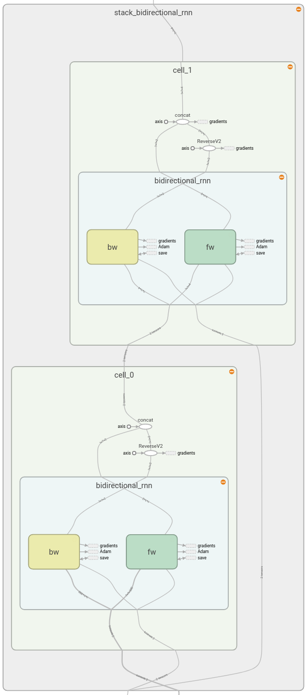

# TextClassification 
A proof of concept bi-directional LSTM text classifier written in TensorFlow.

### Introduction
This repo explores sentiment classification on the [Cornell Movie Review Dataset](http://www.cs.cornell.edu/people/pabo/movie-review-data/) and on the [Stanford Large Movie Review Dataset](http://ai.stanford.edu/~amaas/data/sentiment/).

The purpose of this repo is to explore the stacked, bidirectional LSTM architecture on text input.



### Installation
The preferred method for starting this notebook is to create a new environment in `conda`:

```
$ conda create --name TextClassification
$ source activate TextClassification
$ conda install pip
$ pip install -r requirements.txt
$ jupyter notebook 
```
